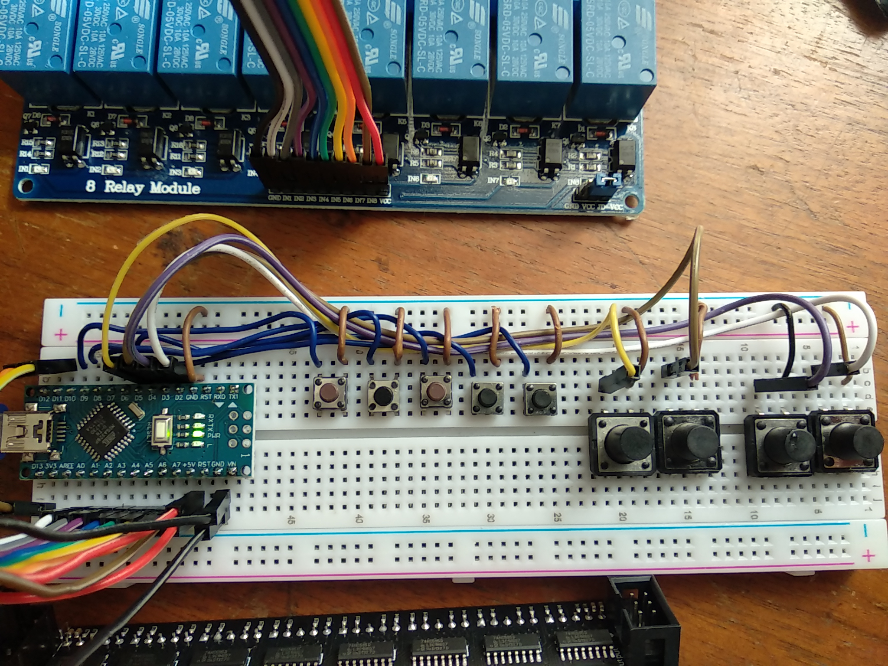
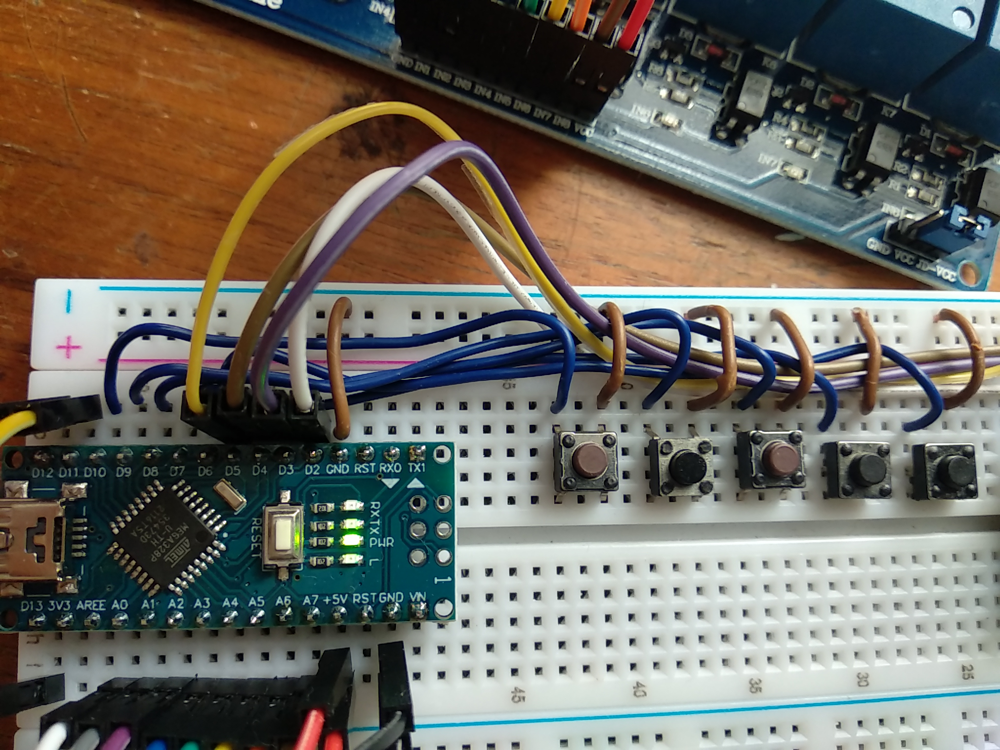
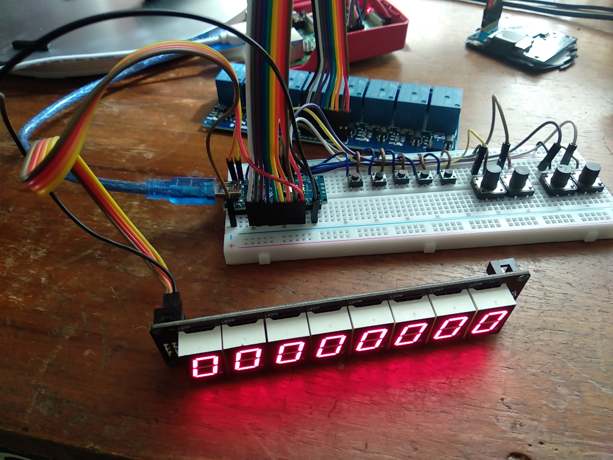
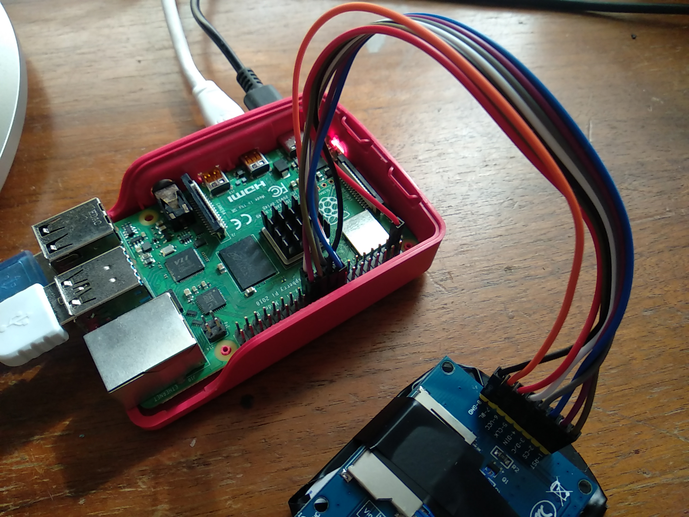

# ABC-Flipper

**A Pinball Machine for solving Anagram Puzzles! (In cooperation with David Moises)**

# Preparation

## Material

| Nr.  | Description                        | 
| ---- | ---------------------------------- | 
| 1    | 1 x RaspberryPi 4                  | 
| 2    | 1 x Teensy2.0++ (or Teensy3.2)     |
| 3    | 5 x TeensyLC for Minidisplay Screens |   
| 4    | 2 x 8-Relay Module for Arduino     | 
| 5    | 5 x SPI LCD Display (ST7735, 160x128, SPI) | 
| 6    | Breadboard, jumper wires, buttons/reed switches | 

## Connect components as shown

(TBD: update photos!)

## Install SW-Requirements

| Nr.  | Description                       | Source                                                       |
| ---- | --------------------------------- | ------------------------------------------------------------ |
| 1    | Python3                           | Open an command shell window and check your python/python3 version: `python3 --version'. The recommended version is python3.8 or newer |
| 2    | pyserial library                  | Install via pip: `pip3 install pyserial` |
| 3    | pygame library                    | Install via pip: `pip3 install pygame`   |
| 4    | pillow library                    | Install via pip: `pip3 install pillow`   |
| 5    | Arduino IDE                       | Download from Arduino website https://www.arduino.cc        |
| 6    | Teensyduino Add-On                | Download from website https://www.pjrc.com/teensy/td_download.html         |
| 7    | Adafruit_GFX library              | Install using Arduino library manager |
| 8    | Adafruit_ST7735 library           | Install using Arduino library manager |

## Deploy Software

* Build and flash the Arduino code (folders src/arduinoIO and src/teensyLC_LCD) 
* Install custum fonts (copy segment.ttf to folder ~/.fonts, update font cache)
* run python3 flipper.py
* install startup script: sudo nano /etc/xdg/autostart/display.desktop, add:
    [Desktop Entry]
    Name=ABCFlipper
    Exec=/usr/bin/python3 /home/pi/ABC-Flipper/src/flipper.py

* configure read-only filesystem (Preferences -> RaspberryPi Configuration -> Performance)

